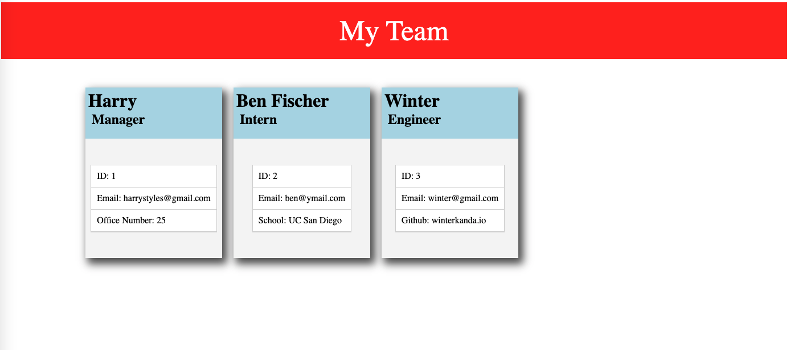

# Get To Know Your Team!

## Description
This application can be used by a manager who wants to generate a webpage which displays their team's basic information and allows them quick access to their emails and GitHub profiles. It is a Node.js command-line application, which when invoked, takes in information about employees, their managers, role, and their team to generate an HTML webpage showing a clean, summarized version of each person. 

&nbsp;

## Built With
* HTML 
* CSS
* Jest
* Inquirer
* JavaScript
* Node

&nbsp;

## Sneak Peek

&nbsp;

## Walkthrough Video
https://watch.screencastify.com/v/YpSRwcGkr3llXZwphyND

&nbsp;

## Contribution Guidelines

Made by Winter Kanda 

@2021 Copyright